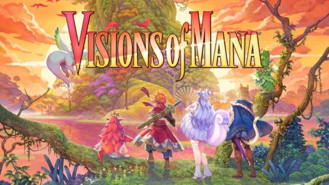
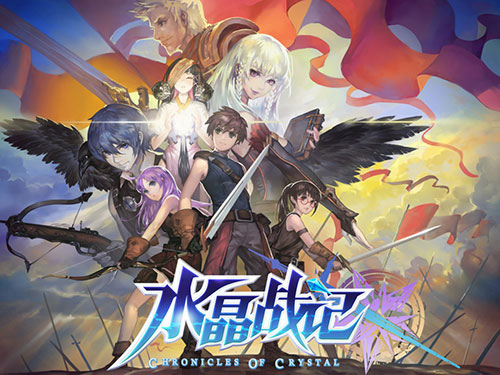
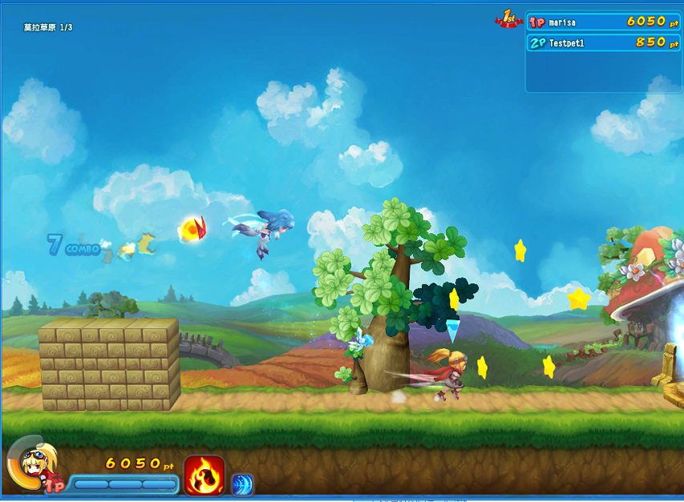
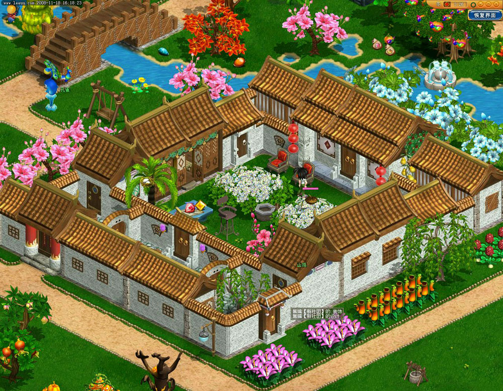

# Summary

15年经验的游戏程序，开发过不同类型的游戏 (ACT, ARPG, CCG, SLG)。从PC端到移动端，成功发布过 5 款产品。热爱游戏的资深玩家，从 FC马里奥开始，玩过大量游戏，见证了次世代和移动游戏的发展。最爱 CRPG 和动作游戏，街霸5超过1000小时，艾尔登法环300小时。

## Skills

**语言** C++, C#, Python, Lua

**引擎** Unity3D, Unreal Engine

**工具** Spine, Live2D, Magica Cloth2, CRIWARE Softdec2, WWISE, Bullet, Box2D, IMGUI, Cocos2d-x 

**擅长** Gameplay, Combat System, Story System, Animations, Physics, Networking, GUI, Tools

## Career
- [阿里巴巴灵犀互娱](https://www.lingxigames.com/) 技术专家 (2022-2024)
- [网易游戏](https://www.neteasegames.com/) 技术专家 (2011-2022)
- 上海扬耀网络 中级工程师 (2010~2011)
- [乐游网](http://rc.leeuu.com/) 游戏开发工程师 (2006~2009)

## Education

西安理工大学, 材料物理学士学位 (2001~2005)

********

## Projects
### 二次元育成, 灵犀互娱 (2022-2024)

- 职位：客户端和剧情系统开发
- 类型：SLG
- 平台：移动
- 开发工具：Unity3D, C#, Lua
- 简介：体育题材的二次元育成游戏，拥有丰富的角色和故事情节，尚未发布。

### 动作游戏项目, 樱花工作室 (2020-2022)

[YouTube Video](https://youtu.be/9biJipMQ-9Y)

- 职位：项目主程 / 多人游戏组长
- 类型：ACT / ARPG
- 平台：PS4/5
- 开发工具：UE4, C++, Python
- 简介：参与多款动作游戏项目的开发，包括与 Square-Enix 合作开发的 **圣剑传说 Visions of Mana**。

### [阴阳师百闻牌](https://ssr.163.com/)

[YouTube Video](https://youtu.be/8XSc2hGH3Ak)

- 职位：客户端主程
- 类型：CCG
- 平台：iOS, Android
- 开发工具：NeoX (3D Engine), C++, Python
- 简介：和风对战卡牌游戏。每位玩家都可以选择四个式神构成卡组，利用这四个式神的核心技能，根据策略调遣他们的法术牌、战斗牌以及形态牌，在战斗区进行攻防博弈，为自己取得最终胜利。

********

### 魂械纪元

[YouTube Video](https://youtu.be/wGAwF4LlvWY)

- 职位：项目主程
- 类型：ACT/MOBA
- 平台：iOS, Android
- 开发工具：NeoX (3D Engine), C++, Python
- 简介：横版动作MOBA，支持8人组队对战(4 vs 4)，将动作游戏的打击感融合到MOBA的对抗之中，拟营造独特的游戏体验。项目历时1年半，经过两次Test Flight测试后宣告终止。

********

### 魂之幻影

[YouTube Video](https://youtu.be/dAz8r9zStQ4) 

- 职位：项目主程
- 类型：ARPG
- 平台：iOS, Android
- 开发工具：NeoX (3D Engine), C++, Python
- 简介：横版动作RPG，有主线剧情模式和多人对战模式，AppStore最佳新游戏推荐，下载榜Top 10，畅销榜Top 50

********

### 水晶战记

[YouTube Video](https://youtu.be/dE_K94Xy76E)

- 职位：高级程序
- 类型：APRG
- 平台：PC
- 开发工具：NeoX (3D Engine), C++, Python
- 简介：发布于[网易游戏星城](http://xc.163.com)平台上的横版动作游戏，四人组队挑战关卡，无双式爽快击倒大量敌人，并完成各种任务，获得奖励

********

### [风行岛](http://xc.163.com/gameintro/game/fxd/yxjs.html)

[YouTube Video](https://youtu.be/CNS8KHGz1I0)

- 职位：高级程序
- 类型：ACT
- 平台：PC
- 开发工具：NeoX (3D Engine), C++, Python
- 简介：发布于[网易游戏星城](http://xc.163.com)平台上的横版竞速游戏，支持四人联网，在不同关卡内争夺第一名通过终点，途中可利用各种道具进行对抗。

********

### 模拟人生
- 职位：客户端主程
- 类型：模拟经营
- 平台：PC
- 开发工具：Gamebryo, C++, C#
- 简介：3D-MMO模拟经营游戏，目标是打造3D版的浪漫庄园。项目历时1年，因资金不足而终止。

********

### [浪漫庄园](http://rc.leeuu.com)

[YouTube Video](https://youtu.be/GPf5Xa5EeUw)

- 职位：初级程序
- 类型：模拟经营
- 平台：PC
- 开发工具：In-house 2D Engine, C++
- 简介：MMO模拟经营游戏，玩家通过种植，养殖，采掘，生产，建造等，来经营自己的庄园。游戏在DIY方面拥有很高的自由度，玩家可以自己设计房屋，庄园，服饰，并生成图纸跟朋友进行交换。
