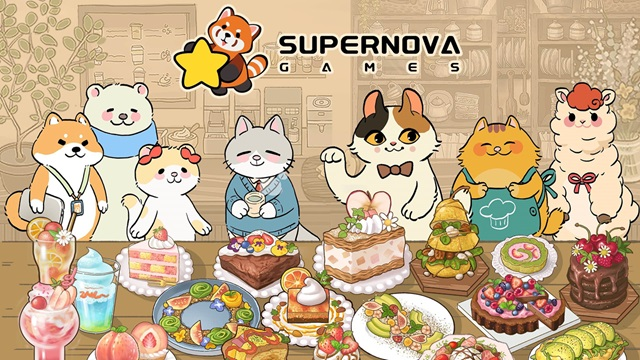
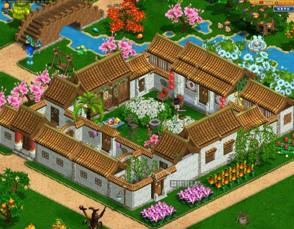

## Summary

I'm a game programmer with over **15 years of experience** in the game industry. I had participated in the development of multiple commercial games across a variety of genres (**ACT, ARPG, CCG, SLG**) and platforms (**PC, iOS, Android**). Among them, 5 were successfully released and generated substantial profits, with 2 of them being under my leadership. I’m Proficient in game architect, gameplay development, character animation, game physics, GUI, networking, and tools development. I also have some experience in computer graphics, game server and database. 

I’m Proficient in **Unity3D** and **Unreal Engine** game development. I had written in-house C++ engine code for years in game industry. I can handle almost everything of a game such as character controller, combat system, animations, physics, networking, GUI, tools, and more. I can also help with graphic code (but NOT AAA title graphic). 

I'm full of passion for games and technique. I'm not only a developer, but also a hardcore player. I spend thousands of hours in games such as Street Fighter 5, Elden Ring, Cyberpunk 2077, Baldur's Gate 3.

## Skills
- **Languages:** C++, C#, Python, Lua
- **Engines:** Unity3D, Unreal Engine
- **Tools:** Spine, Live2D, WWISE, CRIWARE Plugins, Bullet, Box2D, IMGUI, Cocos2d-x 
- **Fields:** Gameplay, Combat System, Animations, Physics, Networking, GUI, Tools

## Career
- [Supernova Games](https://www.gamesupernova.com/), Unity Engineer (2024-Present)
- [LingXi Games of Alibaba Group](https://www.alibabagroup.com/en-US/about-alibaba-businesses-1496656377454526464), Senior Engineer (2022-2024) 
- [NetEase Games](https://www.neteasegames.com/), Senior Engineer (2011-2022)  
- YangYao Games, Game Engineer (2010-2011)  
- Leeuu Games, Game Engineer (2006-2009)  

## Education
- [XiAn University of Technology](https://www.xaut.edu.cn/), Bachelor of Materials Physics 
- **Spoken Language:** Chinese/Cantonese (native), English (conversational)

## Projects

### Purr-fect Chef: Cats Can Cook (2024-Present)

[App Store](https://apps.apple.com/us/app/purr-fect-chef-cats-can-cook/id1603186963) | [Google Play](https://play.google.com/store/apps/details?id=com.gameplus.teaapp&hl=en_US) | [Steam](https://store.steampowered.com/app/3510590/)

**Development Tools:** Unity3D, C#, Spine

**Target Platform:** Mobile & PC

**Project description:**   This project was originally developed using Cocos2d and is now being ported to Unity3D, with
a comprehensive upgrade in technology, graphics, animations, etc. I am responsible for the complete rewrite of the Unity portion.

**My role:** Unity Engineer

**My accomplishments:** Rewrite the gameplay, upgrade graphics and animations, patching, networking and other aspects.

### Basketball Girls: AIM FOR THE SKY (2022-2024)

[Gameplay Video](https://youtu.be/j9fXoaww16U?si=5vAcnCpZ30Xd9TPS)

**Development Tools:** Unity3D, C#, Lua, Live2D

**Target Platform:** Mobile

**Project description:**  The project was originally found to replicate the success of *Uma Musume Pretty Derby*. Players manage a girls' basketball club in the game, explore the stories of the girls' basketball team. I joined the project at an early stage to help the team to build the story toolchain, character animation and physics. 

**My role:** Lead Gameplay / Story Engineer

**My accomplishments:**

1. Implemented the story toolchain.
2. Worked with TA to bring the cartoon shading 3D characters to the story scene. 
3. Implemented the Lua GUI scripting framework. 
4. Extended the Unity timeline functionality for complex animations and story system. 

### Visions of Mana (2020-2022)

[YouTube Video](https://youtu.be/9biJipMQ-9Y) | [Steam](https://store.steampowered.com/app/2490990/_Visions_of_Mana/)

**Development Tools:** UE4, C++, Python, GAS

**Target Platform:** PC, PS4/5, Xbox

**Project description:**  NetEase Sakura Studio collaborated with Square-Enix to develop the game and undertook the development work. During this period, I worked at the studio and involved in the development of the game.

**My role:** Lead Multiplayer Engineer

**My accomplishments:**

1. Maintained the Unreal Python binding plugin which was used for gameplay scripting. Ported the Python runtime to PS4/5.
2. Developed several experimental multiplayer gameplay prototypes.
3. Led a team to develop a generic networked combat system.

### Onmyoji  The  Card  Game (2018-2020)

[YouTube Video](https://youtu.be/8XSc2hGH3Ak)

[App Store](https://apps.apple.com/us/app/onmyoji/id1257031979) | [Google Play](https://play.google.com/store/apps/details?id=com.netease.onmyoji.gb&hl=en_US) | [Steam](https://store.steampowered.com/app/551170/Onmyoji/)

**Development Tools:** NeoX, C++, Python, Spine, CRIWARE Sofdec2, Cocos2d-x

**Target Platform:** Mobile

**Project description:** The game was released on iOS/Android/Steam. It’s a card game like MTG. Players purchase packs to collect cards, and then engage in online battles with other players.

**My role:** Lead Client Engineer

**My accomplishments:**

1. Implemented the graphic effect of the cards and battlefield. 
2. Implemented the story system which was a runtime implementation of Kirikiri / KAG3 script (a markdown language for writing visual novels)
3. Implemented the battle recording and playback system.

### Soul and Machine (2016-2018)

[YouTube Video](https://youtu.be/wGAwF4LlvWY)

**Development Tools:** NeoX, C++, Python, Cocos2d-x

**Target Platform:** Mobile

**Project description:** 3D side scrolling action MOBA game. Support 4 vs 4 team fighting. The game was interrupted after twice iOS test flight. 

**My role:** Lead Engineer

**My accomplishments:** 

1. Deterministic lockstep synchronization. 
2. Networked combat system. 
3. ECS game architecture. 
4. Led the development of character action editor and level editor.

### The Phantom Soul (2014-2016)

[YouTube Video](https://youtu.be/mKkVkG_UrrY)

**Development Tools:** NeoX, C++, Python, Cocos2d-x

**Target Platform:** Mobile

**Project description:** 3D Side scrolling multiplayer ARPG.  Challenge dungeons with a team of maximum 4 players or engaging in 1 vs 1 PVP battle. The game was released on iOS/Android.

**My role:** Lead Engineer

**My accomplishments:** 

1.	Led the programmer team to accomplish the development of the game.
2.	Designed and constructed the game architecture.
3.	Implemented the character controller, the fighting system, and the companion character editor.
4.	Implemented the state synchronization mechanism.
5.	Implemented various gameplay features, such as AI driven by behavior tree, special skill effects, etc.

### Chronicles of Crystal (2012-2014)

[YouTube Video](https://youtu.be/dE_K94Xy76E)

**Development Tools:** NeoX, C++, Python

**Target Platform:** PC

**Project description:** A side scrolling multiplayer action game released on NetEase casual game platform  iTown (PC). It supported 4-player team to challenge dungeons.

**My role:** Gameplay / Multiplayer Engineer

**My accomplishments:** 

1. Networked combat system.
2. Collision detection system.
3. AOI (area of interest) system.
4. Level editor.

### Windy Island (2011-2012)

[YouTube Video](https://youtu.be/WnF3DK0E0WM)

**Development Tools:** NeoX, C++, Python

**Target Platform:** PC

**Project description:** The game was a side scrolling multiplayer racing game. Maximum 4 players raced in the scene like Super Mario, attacked each other using various items picked on the path. The game was released on NetEase casual game platform iTown (PC)

**My role:** Gameplay / Multiplayer / Tool Engineer

**My accomplishments:** 

1. Gameplay features
2. Level editor
3. Character synchronization

### Romantic Country (2008)

[YouTube Video](https://youtu.be/GPf5Xa5EeUw)

**Development Tools:** C++

**Target Platform:** PC

**Project description:** Multiplayer simulation game released on PC in 2008. Like Harvest Moon, players manage their own farms by planting corps and fruit trees, raising livestock, creating machinery, building house and dressed it with furniture. Players can visit each other’s farm or meet in the town. 
There was an in-game design tool for players to customize their house. 
The game offered a high degree of freedom and gained very good feedback.

**My role:** Gameplay Programmer

**My accomplishments:** Gameplay features

