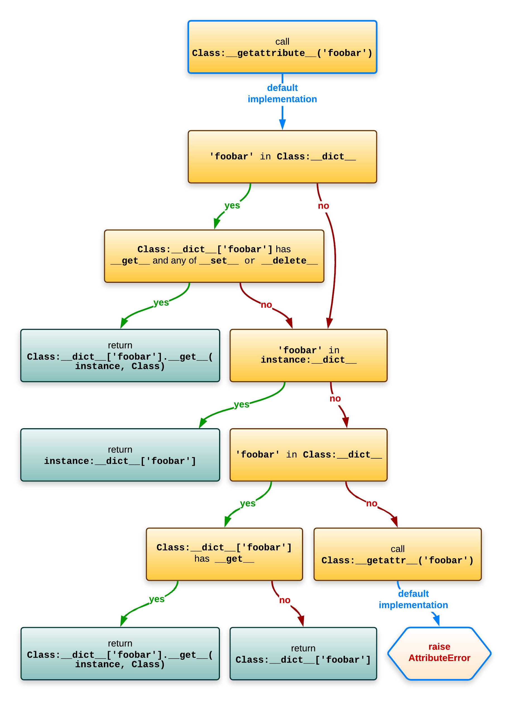
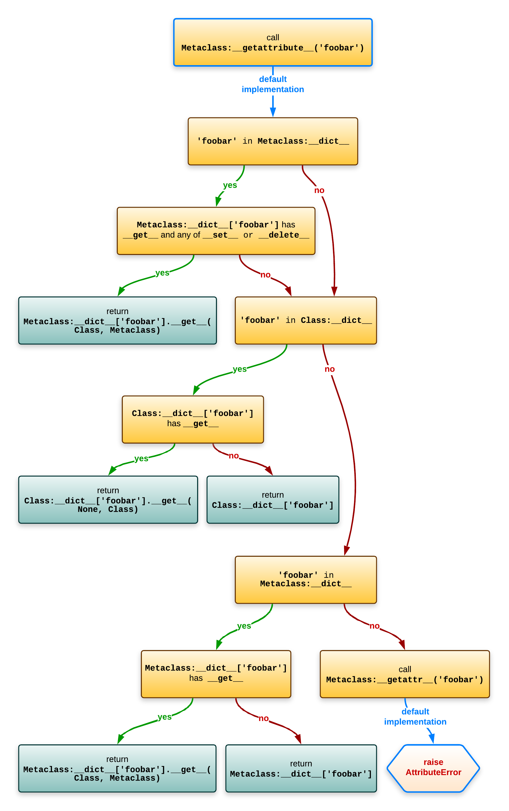

## 类型系统

Python class 和 instance 的关系如下图所示：

graph LR
	n1(instance) --instance of--> n2(class) --instance of--> n3(metaclass)


定义一个 class
```python
class F:
	pass
```
在 CPython 中的执行流程为

graph TD
	n1(opcode CALL_FUNCTION) --> n2(__build_class__) --"find metaclass, name, bases, ns"--> n3(metaclass.__call__)
	n3 --"default metaclass is type"--> n4("type_call(type, args, kwargs)")
	n4 --> n5{obj is instance of type?}
	n5 --yes--> n6("type->tp_init(obj, args, kwargs)")
	n5 --no--> n7(return obj)
	n6 --> n7


创建一个 instance
```python
f = Foo()
```
在 CPython 中的执行流程为

graph TD
	n1(opcode CALL_FUNCTION) --> n2(F.__call__) -- "delegate to object.__call__" --> n3("type_call(type, args, kwargs)")
	n3 -- "delegate to object.__new__" --> n4("obj = type->tp_new(type, args, kwargs)") --> n5{obj is instance of type?}
	n5 --yes--> n6("type->tp_init(obj, args, kwargs)")
	n5 --no--> n7("return obj")
	n6 --> n7


## 属性查找
两个定义：
1. data descriptor：具有接口 ```__get__```，并且有 ```__set__``` 或 ```__delete__``` 其中之一，例如：```@property```
2. non data descriptor：只有 ```__get__```，类成员函数都是这种，通过调用 ```__get__``` 获得 ```bound method```
### 对象属性查找
```python
a = A()
a.foobar
```

- 调用 ```Class.__getattribute__``` (*tp_getattro*) 进行查找，这个函数的选择顺序如下：
	1. Class *data descriptor*：```Class.__dict__['foobar'].__get__(instance, Class)```
	2. ```instance.__dict__['foobar']```
	3. Class *non data descriptor*：```Class.__dict__['foobar'].__get__(instance, Class)```
	4. ```Class.__dict__['foobar']```
- 如果都没有，调用 ```Class.__getattr___```



### 类属性查找
```python
A.foobar
```
- 调用 ```Metaclass.__getattribute__``` (*tp_getattro*) 进行查找，这个函数的选择顺序如下：
	1. Metaclass *data descriptor*：```Metaclass.__dict__['foobar'].__get__(instance, Class)```
	3. Class *non data descriptor*：```Class.__dict__['foobar'].__get__(instance, Class)```
	4. ```Class.__dict__['foobar']```
	5. Metaclass *non data descriptor*
	6. ```Metaclass.__dict__['foobar']```
- 如果都没有，调用 ```Metaclass.__getattr___```



## 元类(metaclass)
下面的代码展示了元类的使用方式，以及执行流程
```python
class Meta(type):
	# 在 Meta.__new__ 之前调用，返回类的名字空间，并作为 class attributes 传给 Meta.__new__
	@classmethod
	def __prepare__(mcs, name, bases, **kwargs):
		print('Meta.__prepare__(mcs=%s, name=%r, bases=%s, **%s)' % (mcs, name, bases, kwargs))
		return {}

	# tp_new, 用来创建 Class 对象（PyTypeObject）
	def __new__(mcs, name, bases, attrs, **kwargs):
		print('Meta.__new__(mcs=%s, name=%r, bases=%s, attrs=[%s], **%s)' % (
			mcs, name, bases, ', '.join(attrs), kwargs))
		return super().__new__(mcs, name, bases, attrs)
		
	# 初始化 Class 对象，对所有 subclass 也都会调用
	def __init__(cls, name, bases, attrs, **kwargs):
		print('Meta.__init__(cls=%s, name=%r, bases=%s, attrs=[%s], **%s)' % (
			cls, name, bases, ', '.join(attrs), kwargs))
		return super().__init__(name, bases, attrs)
		
	# tp_call, 创建实例对象
	def __call__(cls, *args, **kwargs):
		print('Meta.__call__(cls=%s, args=%s, kwargs=%s)' % (cls, args, kwargs))
		return super().__call__(*args, **kwargs)
		
		
class Class(metaclass=Meta, extra=1):
	# 用来创建对象实例
	def __new__(cls, myarg):
		print('Class.__new__(cls=%s, myarg=%s)' % (cls, myarg))
		return super().__new__(cls)
		
	# 初始化
	def __init__(self, myarg):
		print('Class.__init__(self=%s, myarg=%s)' % (self, myarg))
		return super().__init__()
		
	def __str__(self):
		return "<instance of Class; myargs=%s>" % (getattr(self, 'myarg', 'MISSING'))
```

import 上述的模块，输出为：
```bash
Meta.__prepare__(mcs=<class '__main__.Meta'>, name='Class', bases=(), **{'extra': 1})
Meta.__new__(mcs=<class '__main__.Meta'>, name='Class', bases=(), attrs=[__qualname__, __new__, __init__, __str__, __module__], **{'extra': 1})
Meta.__init__(cls=<class '__main__.Class'>, name='Class', bases=(), attrs=[__qualname__, __new__, __init__, __str__, __module__], **{'extra': 1})
```

执行 ```Class(1)```，输出为：
```bash
Meta.__call__(cls=<class '__main__.Class'>, args=(1,), kwargs={})
Class.__new__(cls=<class '__main__.Class'>, myarg=1)
Class.__init__(self=<instance of Class; myargs=MISSING>, myarg=1)
<instance of Class; myargs=1>
```

## Reference
1. [CPython Internal (Github)](https://github.com/zpoint/CPython-Internals#Objects)
2. [Understanding Python metaclasses](https://blog.ionelmc.ro/2015/02/09/understanding-python-metaclasses/)
3. [Python Behind the Scene (Blog)](https://tenthousandmeters.com/tag/python-behind-the-scenes/)
4. [Inside The Python Virtual Machine (FreeBook)](https://leanpub.com/insidethepythonvirtualmachine/read)
