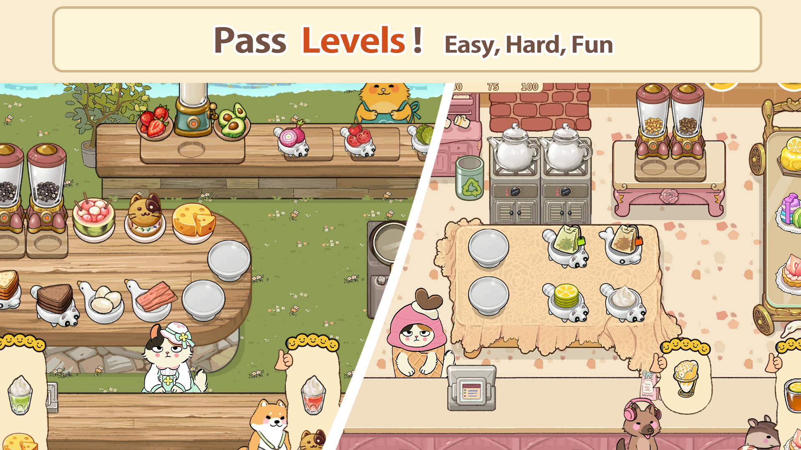
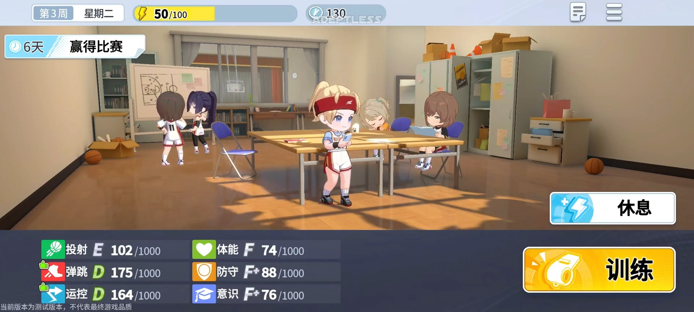
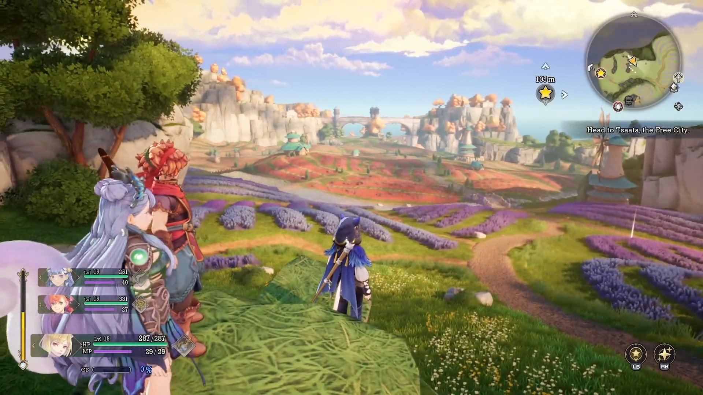
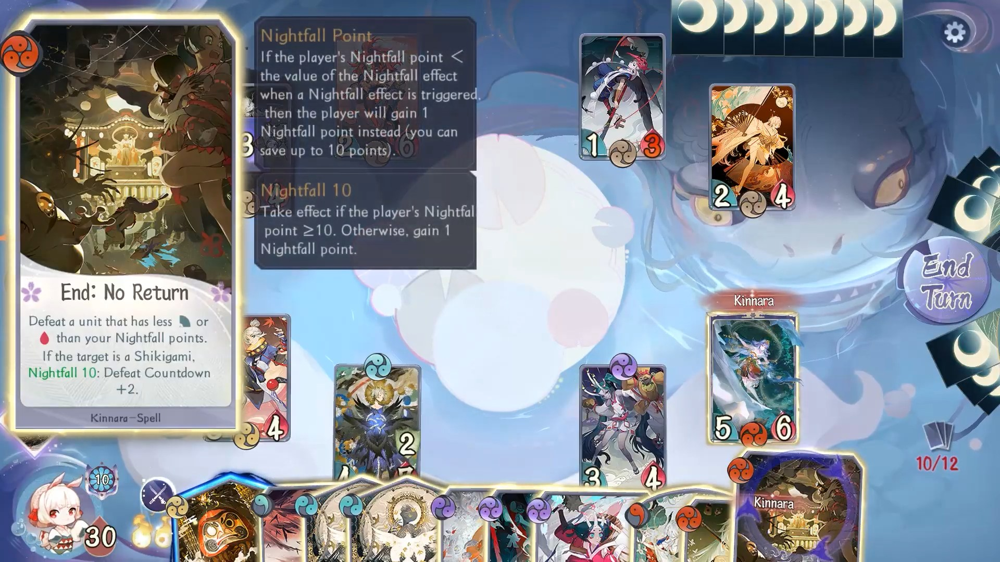
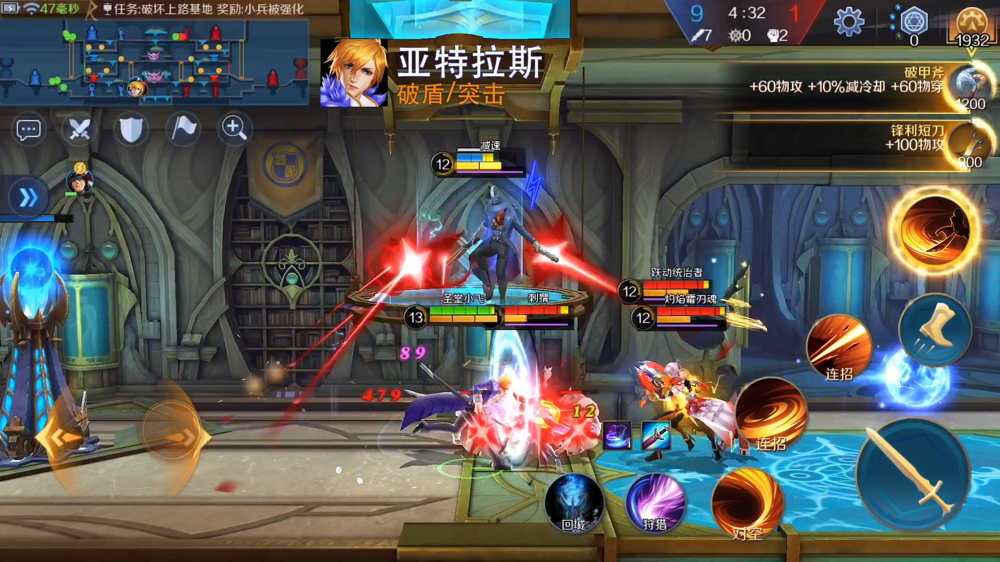
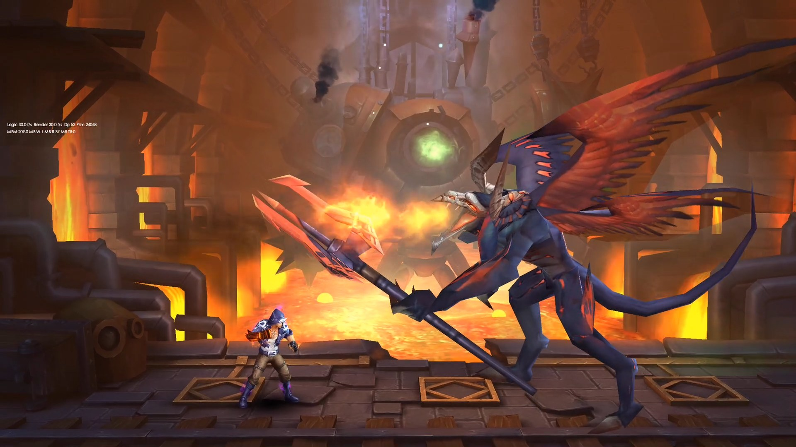
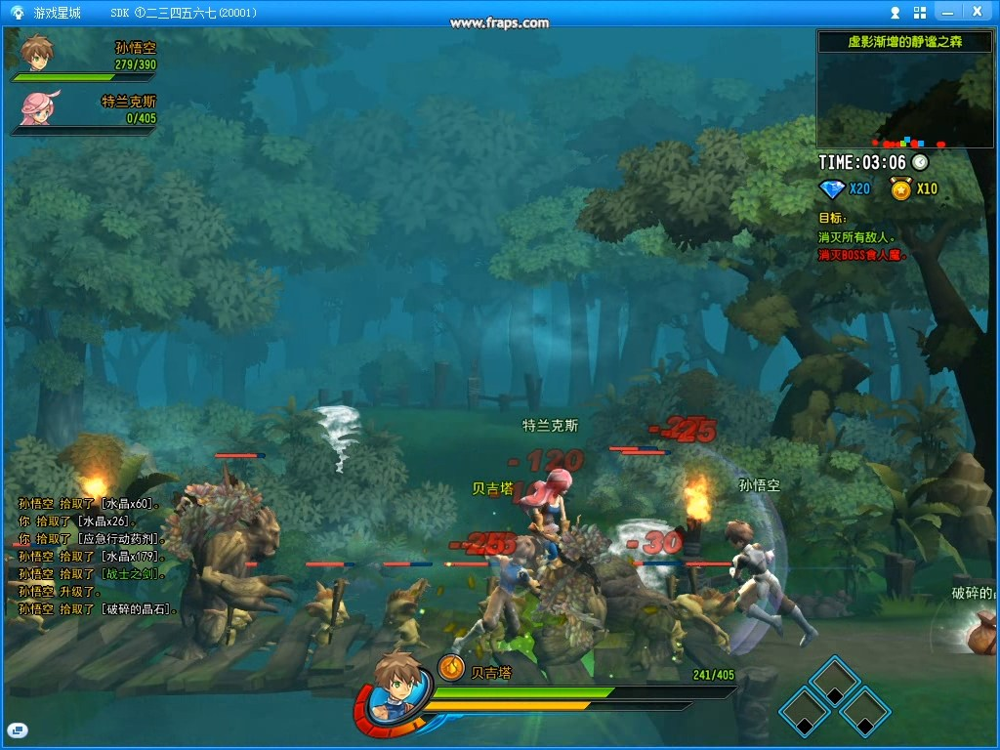
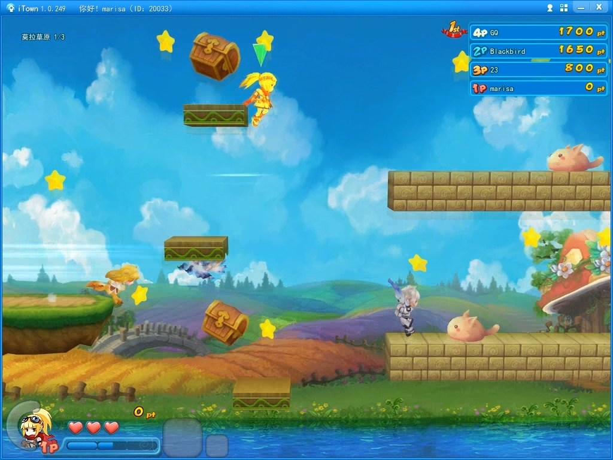

## Summary

**Lead Gameplay / Multiplayer Engineer (Unity, Unreal, C++)**

Lead Gameplay and Multiplayer Engineer with over **15 years of experience** developing commercial games across **ACT, ARPG, CCG, and SLG** genres for **PC, mobile (iOS and Android), and console (PlayStation and Xbox)**. I have contributed to multiple shipped commercial titles and have led engineering across major projects from architecture through delivery.

I specialize in game architecture, gameplay systems, combat, animation, physics, networking, UI, tools, and live-update infrastructure. I am highly experienced with **Unity**, **Unreal Engine**, and proprietary C++ engines, and I can also contribute to graphics programming for gameplay and production needs.

I am passionate about games both as a developer and as a player. Having spent thousands of hours with titles such as Street Fighter 5, Elden Ring, Cyberpunk 2077, and Baldur's Gate 3, I have a strong sense of what makes games feel engaging, polished, and rewarding, and I bring that perspective into development decisions.

## Skills
- **Languages:** C++, C#, Python, Lua
- **Engines:** Unity, Unreal Engine, NeoX / proprietary C++ engines
- **Specialties:** Gameplay, Combat Systems, Animation Systems, Physics, Multiplayer Networking, UI, Tools Development, Live Update Systems
- **Middleware / Libraries:** Spine, Live2D, Wwise, CRIWARE, Bullet, Box2D, IMGUI, Cocos2d-x

## Career
- [Supernova Games](https://www.gamesupernova.com/), Unity Engineer (2024 - Present)
- [LingXi Games of Alibaba Group](https://www.alibabagroup.com/en-US/about-alibaba-businesses-1496656377454526464), Senior Engineer (2022 - 2024)
- [NetEase Games](https://www.neteasegames.com/), Senior Engineer (2011 - 2022)
- YangYao Games, Game Engineer (2010 - 2011)
- Leeuu Games, Game Engineer (2006 - 2009)

## Education
- [XiAn University of Technology](https://www.xaut.edu.cn/), Bachelor of Materials Physics
- **Languages:** Chinese/Cantonese (native), English (conversational)

## Projects

### Purr-fect Chef: Cats Can Cook (2024 - Present)

[App Store](https://apps.apple.com/us/app/purr-fect-chef-cats-can-cook/id1603186963) | [Google Play](https://play.google.com/store/apps/details?id=com.gameplus.teaapp&hl=en_US) | [Steam](https://store.steampowered.com/app/3510590/)

**Development Tools:** Unity3D, C#, Spine

**Target Platform:** Mobile, PC, WebGL (Reddit)

**Project description:** A new title in the Purr-fect Chef franchise, built in Unity for live operations and cross-platform delivery.

**My role:** Senior Engineer

**My accomplishments:**
1. Architected the game framework and core systems, establishing a scalable foundation for long-term feature development.
2. Designed and implemented the resource and script patching system, enabling faster live updates and hotfix workflows.
3. Created an AI-integrated localization workflow, improving multilingual content delivery efficiency.
4. Created an AI-assisted content workflow for short stories and adventures, accelerating narrative iteration.
5. Implemented the multiplayer framework, enabling online gameplay features.

### Basketball Girls: AIM FOR THE SKY (2022 - 2024)

[Gameplay Video](https://www.youtube.com/watch?v=gb1K52Zx5ok)

**Development Tools:** Unity3D, C#, Lua, Live2D

**Target Platform:** Mobile

**Project description:** A mobile character-management game inspired by *Uma Musume Pretty Derby*, where players manage a girls' basketball club and explore team storylines. I joined early to help build the story toolchain, character animation pipeline, and physics systems.

**My role:** Senior Engineer

**My accomplishments:**
1. Developed the story toolchain, enabling writers and designers to author interactive story content efficiently.
2. Collaborated with technical artists to integrate cel-shaded 3D characters into story scenes, improving visual quality and consistency.
3. Built the Lua UI scripting framework, improving UI iteration speed.
4. Extended Unity Timeline functionality, enabling more complex story flows and animation sequencing.

### Visions of Mana (2020 - 2022)

[YouTube Video](https://youtu.be/9biJipMQ-9Y) | [Steam](https://store.steampowered.com/app/2490990/_Visions_of_Mana/)

**Development Tools:** UE4, C++, Python, GAS

**Target Platform:** PC, PS5, Xbox

**Project description:** A major entry in Square Enix's long-running Mana series, shipped on Steam, PS4/5, and Xbox. NetEase Sakura Studio collaborated with Square Enix on development, and my primary focus was studio-wide Unreal Engine infrastructure and multiplayer R&D.

**My role:** Lead Multiplayer Engineer

**My accomplishments:**
1. Maintained the Unreal Python binding plugin and ported the Python runtime to PS4/5, enabling scripting workflows on console targets.
2. Developed multiple experimental multiplayer gameplay prototypes, supporting rapid mode validation.
3. Led a small engineering team to design and build a generic networked combat system, creating reusable multiplayer infrastructure for future projects.

### Onmyoji The Card Game (2018 - 2020)

[Gameplay Video](https://youtu.be/8XSc2hGH3Ak) | [Narrative Video](https://youtu.be/TiPahqEEc9Q)

**Development Tools:** NeoX, C++, Python, Spine, CRIWARE Sofdec2, Cocos2d-x

**Target Platform:** Mobile

**Project description:** A strategy card game similar to MTG. Launched on December 12, 2019, the game has remained live for more than six years, with players collecting cards through packs and battling each other online.

**My role:** Lead Client Engineer

**My accomplishments:**
1. Led client-side technical planning and architecture, coordinating core systems, UI, story, battle presentation, and replay workflows.
2. Architected the client framework, enabling stable long-term feature development.
3. Developed card and battlefield visual effects, improving gameplay presentation quality.
4. Built the story system as a runtime implementation of Kirikiri/KAG3 scripts, enabling flexible narrative content authoring.
5. Developed the battle recording and playback system, enabling replay and debugging workflows.

### Soul and Machine (2016 - 2018)

[YouTube Video](https://youtu.be/wGAwF4LlvWY)

**Development Tools:** NeoX, C++, Python, Cocos2d-x

**Target Platform:** Mobile

**Project description:** A 3D side-scrolling action MOBA with 4v4 team battles. The project was discontinued after two iOS TestFlight rounds.

**My role:** Lead Engineer

**My accomplishments:**
1. Led overall client engineering across gameplay, networking, tools, and architecture during prototype and TestFlight development.
2. Built deterministic lockstep synchronization, enabling authoritative multiplayer consistency.
3. Developed a networked combat system, supporting real-time competitive gameplay.
4. Designed an ECS game architecture, improving modularity and maintainability.
5. Led development of character action and level editors, improving content production efficiency.

### The Phantom Soul (2014 - 2016)

[YouTube Video](https://youtu.be/mKkVkG_UrrY)

**Development Tools:** NeoX, C++, Python, Cocos2d-x

**Target Platform:** Mobile

**Project description:** A 3D side-scrolling multiplayer ARPG. Players could challenge dungeons in teams of up to four or engage in 1v1 PvP. The game was released on iOS and Android.

**My role:** Lead Engineer

**My accomplishments:**
1. Led the programming team from core development through launch, coordinating gameplay, online systems, tools, and production support.
2. Designed and implemented the game architecture, supporting core gameplay and online systems.
3. Developed the character controller, combat system, and companion editor, enabling scalable gameplay development.
4. Implemented the state synchronization mechanism, improving multiplayer reliability.
5. Developed gameplay features such as behavior-tree-driven AI and special skill effects, expanding combat depth.

### Chronicles of Crystal (2012 - 2014)

[YouTube Video](https://youtu.be/dE_K94Xy76E)

**Development Tools:** NeoX, C++, Python

**Target Platform:** PC

**Project description:** A side-scrolling multiplayer action game released on NetEase's iTown PC platform. It supported four-player co-op dungeon runs.

**My role:** Gameplay / Multiplayer Engineer

**My accomplishments:**
1. Developed the networked combat system, enabling online co-op gameplay.
2. Built the collision detection system, improving gameplay stability.
3. Built the AOI (area of interest) system, optimizing network performance.
4. Created the level editor, improving production speed for content teams.

### Windy Island (2011 - 2012)

[YouTube Video](https://youtu.be/WnF3DK0E0WM)

**Development Tools:** NeoX, C++, Python

**Target Platform:** PC

**Project description:** A side-scrolling multiplayer racing game. Up to four players raced in stages similar to Super Mario and attacked each other using items collected along the way. The game was released on NetEase's iTown PC platform.

**My role:** Gameplay / Multiplayer / Tool Engineer

**My accomplishments:**
1. Developed gameplay features, expanding core race-combat interactions.
2. Built the level editor, improving stage iteration speed.
3. Implemented character synchronization, enabling stable multiplayer races.

### Romantic Country (2008)

[YouTube Video](https://youtu.be/GPf5Xa5EeUw)

**Development Tools:** C++

**Target Platform:** PC

**Project description:** An innovative multiplayer simulation game released on PC in 2008 and operated for about 10 years. The game centered on user-generated content, allowing players to design homes, farms, and clothing and share their creations with the community. These systems created a high degree of player freedom and helped sustain long-term engagement.

**My role:** Gameplay Programmer

**My accomplishments:** Developed core gameplay features and contributed to the in-game house design tool.
