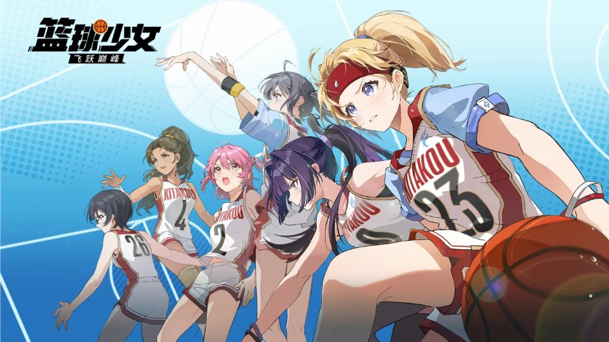
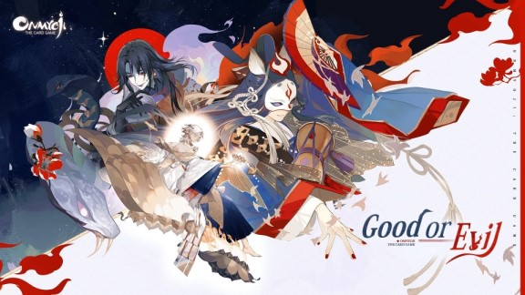
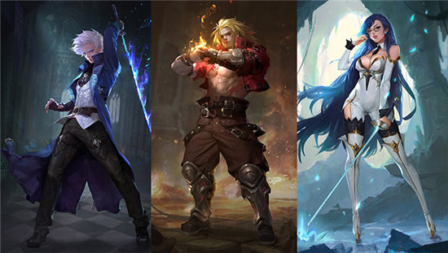
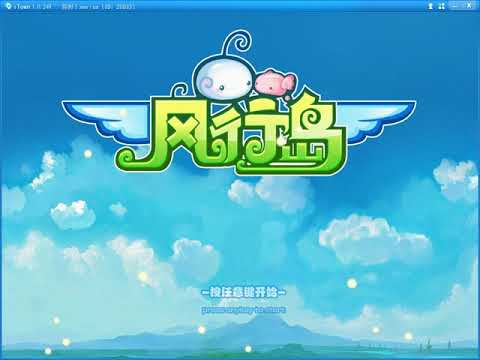

## Summary

**Lead Gameplay / Multiplayer Engineer (Unity, Unreal, C++)**

I'm a game programmer with over **15 years of experience** in the game industry. I have contributed to multiple commercial games across a variety of genres (**ACT, ARPG, CCG, SLG**) and platforms (**PC, iOS, Android**). Five of these titles were successfully released and generated substantial revenue, and I led development on two of them. I am proficient in game architecture, gameplay development, character animation, physics, GUI, networking, and tools development. I also have experience with computer graphics, game servers, and databases.

I’m proficient in **Unity3D** and **Unreal Engine** development. I also contributed to in-house C++ engine development for years. I can handle almost every part of a game, including character controllers, combat systems, animation systems, physics, networking, GUI, and tools. I can also contribute to graphics programming (non-AAA rendering scope).

I'm passionate about both games and technology. I'm not only a developer but also a hardcore player. I’ve spent thousands of hours in games such as Street Fighter 5, Elden Ring, Cyberpunk 2077, and Baldur's Gate 3.

## Skills
- **Languages:** C++, C#, Python, Lua
- **Engines:** Unity3D, Unreal Engine
- **Tools:** Spine, Live2D, WWISE, CRIWARE Plugins, Bullet, Box2D, IMGUI, Cocos2d-x
- **Fields:** Gameplay, Combat Systems, Animation Systems, Physics, Networking, GUI, Tools Development

## Career
- [Supernova Games](https://www.gamesupernova.com/), Unity Engineer (2024 - Present)
- [LingXi Games of Alibaba Group](https://www.alibabagroup.com/en-US/about-alibaba-businesses-1496656377454526464), Senior Engineer (2022 - 2024)
- [NetEase Games](https://www.neteasegames.com/), Senior Engineer (2011 - 2022)
- YangYao Games, Game Engineer (2010 - 2011)
- Leeuu Games, Game Engineer (2006 - 2009)

## Education
- [XiAn University of Technology](https://www.xaut.edu.cn/), Bachelor of Materials Physics
- **Spoken Languages:** Chinese/Cantonese (native), English (conversational)

## Projects

### Purr-fect Chef: Cats Can Cook (2024 - Present)

[App Store](https://apps.apple.com/us/app/purr-fect-chef-cats-can-cook/id1603186963) | [Google Play](https://play.google.com/store/apps/details?id=com.gameplus.teaapp&hl=en_US) | [Steam](https://store.steampowered.com/app/3510590/)

**Development Tools:** Unity3D, C#, Spine

**Target Platform:** Mobile, PC

**Project description:** A new-generation title in the Purr-fect Chef franchise, built in Unity to support modern live operations and cross-platform delivery.

**My role:** Unity Engineer

**My accomplishments:**
1. Architected the entire game framework and core systems, creating a scalable foundation for long-term feature delivery.
2. Designed and implemented the resource and script patching system, enabling faster live updates and hotfix workflows.
3. Built an AI-integrated localization workflow, improving content delivery efficiency across languages.
4. Built an AI-assisted content workflow for short stories and adventures, accelerating narrative iteration.
5. Implemented the multiplayer framework, enabling online gameplay features.

### Basketball Girls: AIM FOR THE SKY (2022 - 2024)

[Gameplay Video](https://youtu.be/j9fXoaww16U?si=5vAcnCpZ30Xd9TPS)

**Development Tools:** Unity3D, C#, Lua, Live2D

**Target Platform:** Mobile

**Project description:** The project was originally founded to replicate the success of *Uma Musume Pretty Derby*. In this game, players manage a girls' basketball club and explore team storylines. I joined early to help build the story toolchain, character animation pipeline, and physics systems.

**My role:** Senior Engineer

**My accomplishments:**
1. Implemented the story toolchain, enabling writers and designers to author interactive story content efficiently.
2. Worked with technical artists to bring cel-shaded 3D characters into story scenes, improving visual quality and consistency.
3. Implemented the Lua GUI scripting framework, improving UI iteration speed.
4. Extended Unity Timeline functionality, enabling more complex story flows and animation sequencing.

### Visions of Mana (2020 - 2022)

[YouTube Video](https://youtu.be/9biJipMQ-9Y) | [Steam](https://store.steampowered.com/app/2490990/_Visions_of_Mana/)

**Development Tools:** UE4, C++, Python, GAS

**Target Platform:** PC, PS4/5, Xbox

**Project description:** NetEase Sakura Studio collaborated with Square Enix on this title and undertook major development responsibilities. My primary focus was studio-wide technical infrastructure that supported all projects.

**My role:** Lead Multiplayer Engineer

**My accomplishments:**
1. Maintained the Unreal Python binding plugin and ported the Python runtime to PS4/5, enabling scripting workflows on console targets.
2. Developed multiple experimental multiplayer gameplay prototypes, enabling rapid mode validation.
3. Led a team to build a generic networked combat system, creating reusable infrastructure for multiplayer projects.

### Onmyoji The Card Game (2018 - 2020)

[YouTube Video](https://youtu.be/8XSc2hGH3Ak)

[App Store](https://apps.apple.com/us/app/onmyoji/id1257031979) | [Google Play](https://play.google.com/store/apps/details?id=com.netease.onmyoji.gb&hl=en_US) | [Steam](https://store.steampowered.com/app/551170/Onmyoji/)

**Development Tools:** NeoX, C++, Python, Spine, CRIWARE Sofdec2, Cocos2d-x

**Target Platform:** Mobile

**Project description:** Released on iOS, Android, and Steam, this is a strategy card game similar to MTG. Players collect cards by opening packs and battle each other online.

**My role:** Lead Client Engineer

**My accomplishments:**
1. Architected the client framework, enabling stable long-term feature development.
2. Implemented card and battlefield visual effects, improving gameplay presentation quality.
3. Implemented the story system as a runtime implementation of Kirikiri/KAG3 scripts, enabling flexible narrative content authoring.
4. Implemented the battle recording and playback system, enabling replay and debugging workflows.

### Soul and Machine (2016 - 2018)

[YouTube Video](https://youtu.be/wGAwF4LlvWY)

**Development Tools:** NeoX, C++, Python, Cocos2d-x

**Target Platform:** Mobile

**Project description:** A 3D side-scrolling action MOBA with 4v4 team battles. The project was discontinued after two iOS TestFlight rounds.

**My role:** Lead Engineer

**My accomplishments:**
1. Built deterministic lockstep synchronization, enabling authoritative multiplayer consistency.
2. Built a networked combat system, supporting real-time competitive gameplay.
3. Designed an ECS game architecture, improving modularity and maintainability.
4. Led development of character action and level editors, improving content production efficiency.

### The Phantom Soul (2014 - 2016)

[YouTube Video](https://youtu.be/mKkVkG_UrrY)

**Development Tools:** NeoX, C++, Python, Cocos2d-x

**Target Platform:** Mobile

**Project description:** A 3D side-scrolling multiplayer ARPG. Players could challenge dungeons in teams of up to four or engage in 1v1 PvP. The game was released on iOS and Android.

**My role:** Lead Engineer

**My accomplishments:**
1. Led the programming team to deliver the game, ensuring end-to-end technical execution.
2. Designed and implemented the game architecture, supporting core gameplay and online systems.
3. Implemented the character controller, combat system, and companion editor, enabling scalable gameplay development.
4. Implemented the state synchronization mechanism, improving multiplayer reliability.
5. Implemented gameplay features such as behavior-tree-driven AI and special skill effects, expanding combat depth.

### Chronicles of Crystal (2012 - 2014)

[YouTube Video](https://youtu.be/dE_K94Xy76E)

**Development Tools:** NeoX, C++, Python

**Target Platform:** PC

**Project description:** A side-scrolling multiplayer action game released on NetEase's iTown PC platform. It supported four-player co-op dungeon runs.

**My role:** Gameplay / Multiplayer Engineer

**My accomplishments:**
1. Built the networked combat system, enabling online co-op gameplay.
2. Built the collision detection system, improving gameplay stability.
3. Built the AOI (area of interest) system, optimizing network performance.
4. Built the level editor, improving production speed for content teams.

### Windy Island (2011 - 2012)

[YouTube Video](https://youtu.be/WnF3DK0E0WM)

**Development Tools:** NeoX, C++, Python

**Target Platform:** PC

**Project description:** A side-scrolling multiplayer racing game. Up to four players raced in stages similar to Super Mario and attacked each other using items collected along the way. The game was released on NetEase's iTown PC platform.

**My role:** Gameplay / Multiplayer / Tool Engineer

**My accomplishments:**
1. Implemented gameplay features, expanding core race-combat interactions.
2. Built the level editor, improving stage iteration speed.
3. Implemented character synchronization, enabling stable multiplayer races.

### Romantic Country (2008)

[YouTube Video](https://youtu.be/GPf5Xa5EeUw)

**Development Tools:** C++

**Target Platform:** PC

**Project description:** A multiplayer simulation game released on PC in 2008. Similar to Harvest Moon, players managed farms by planting crops and fruit trees, raising livestock, creating machinery, building houses, and decorating them with furniture. Players could visit each other's farms or meet in town.

The game included an in-game design tool that let players customize their houses.

The game offered a high degree of freedom and received strong player feedback.

**My role:** Gameplay Programmer

**My accomplishments:** Implemented core gameplay features.
